# WebDevelopment-ITAM

IT asset management (ITAM) is a set of business practices and processes that track, deploy, maintain, upgrade, and dispose of IT assets over their lifecycle. An IT Asset Management Program is critical to a company's software compliance, which is advantageous during audits and mergers. It also helps reduce overall organization costs and better control over IT assets.

### Programming Languages:
- The programming language used in the entire backend application is **Python**.
- Using **Python**, we have followed a microservices type of strategy where we have written the entire code in an object-oriented way using an inheritance approach where we have declared user-defined expectations in one class and constant in another class as well as have a base class that acts as a model to **python flask endpoints**.
- In the model, we have used SQL query to retrieve data from MySQL database and store and update the data to MySQL based on API call in python flask.
- For the two-factor authentication, we have used an open-source python package **PyOTP**, and we have implemented time-based OTP authentication via google authenticator.
- In the front-end development, we have used HTML with the bootstrap framework to develop a responsive website to open on any device, such as a mobile phone, iPad, tablet, desktop, or laptop.
- Finally, we have used **JavaScript** for server-side scripting to copy data from one page to another and also to validate HTML forms like a search bar on a table, etc. We have used **chart.js** to create various charts on the dashboard, which will interact with the database using the python flask endpoint.

### Infrastructure Architecture

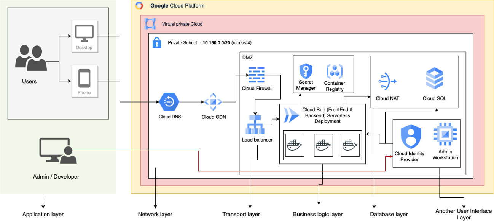

### Entity Relationship Diagram:

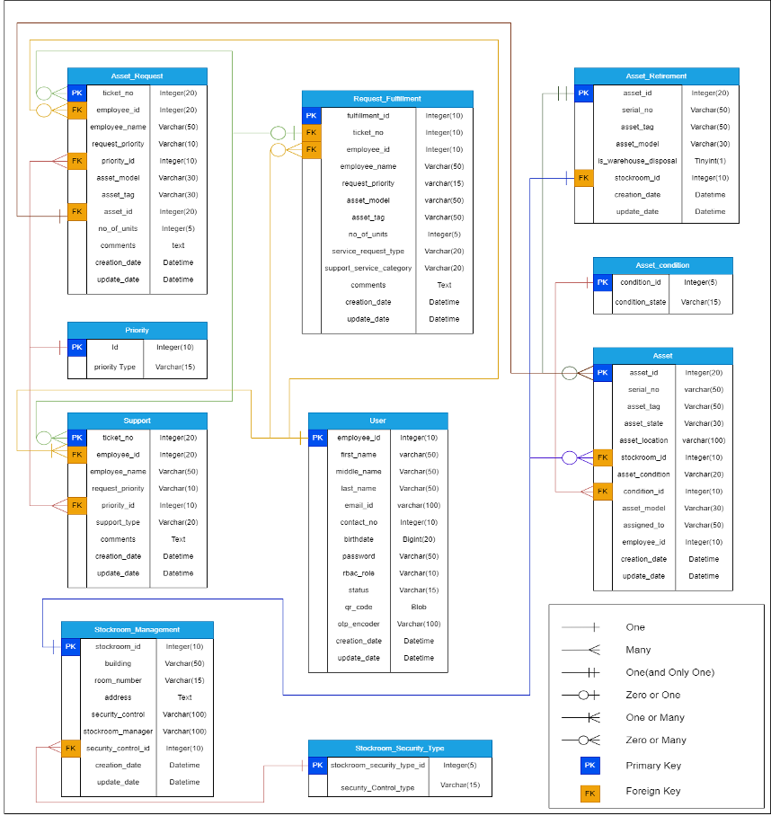

### User Interface

#### Wireframe 1 – Login Page
- The application begins by displaying to the user the login page that assists in user authentication to utilize the web interface created for asset management with two options signing in for existing users and signing up for new users as well as with the forgot password option. 

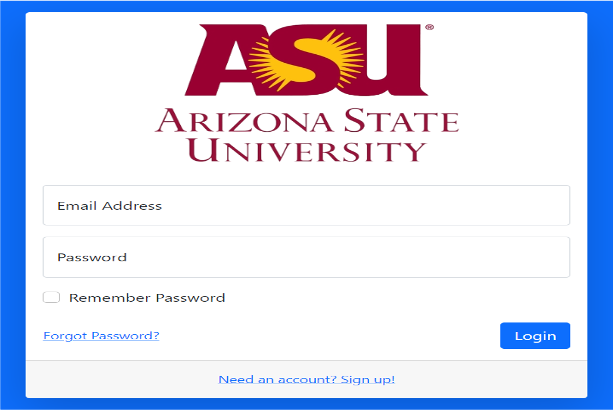

#### Wireframe 1 – Login Page
- Each employee's ID that is connected to their email address has already been assigned to one of the several access levels, so while logging in with their email address, users with different access levels will be sent to distinct pages. First-time users who choose the option to sign up are directed to a sign-up page where they must provide their information, including their first, middle, and last names, contact information, date of birth, and a password. 

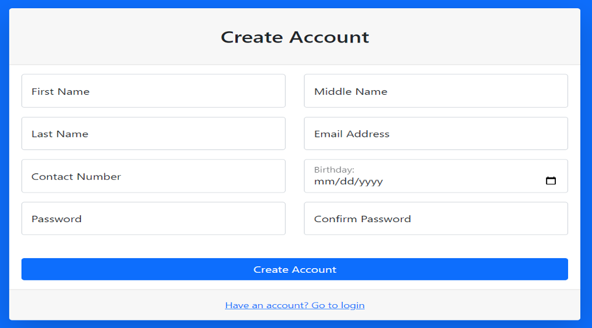

- A user must complete a second verification using two-factor authentication after logging in with their email address and password. Google Authenticator is used in accomplishing this. By receiving a notification or an OTP on their device and entering that, users can proceed. The dashboard screen for each user's role is displayed after a successful login. Additionally, the welcome page and all subsequent pages have a logout option in the upper right corner. 

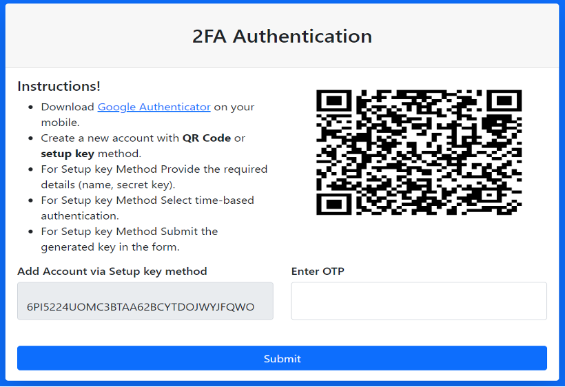

#### Wireframe 2 – Dashboard 
- The user is directed to a dashboard with links to various services when login with the OTP they will be directed to “Go to Dashboard" on the welcome page. Since this dashboard is based on role-based access, it changes depending on the user's position within the organization.

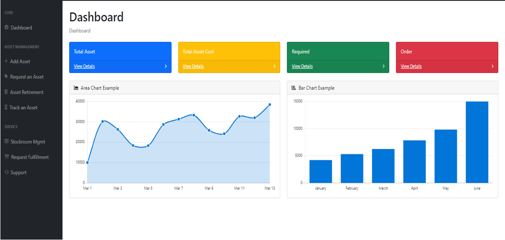

#### Wireframe 3 – Asset Management Processes

- **Asset Entry:** New assets can be added to the system by using this page, it contains the following parameters Serial Number, Asset tag ID, Model of Asset, State of the Asset, Condition, Assigned to, Location, and Select Stockroom and Room.

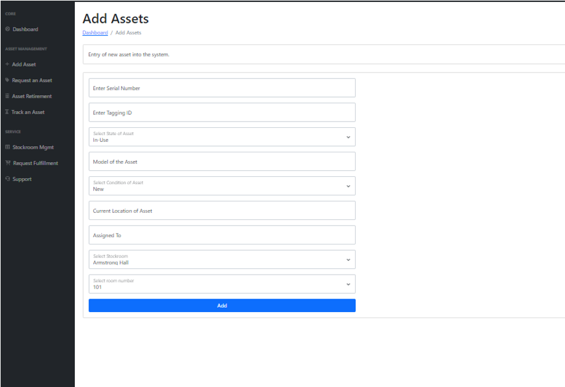

- **Request Assets:** After clicking "Request Asset," a request can be made by selecting a model and entering the quantity of the same model that is needed.  Additionally, a user can submit a single request for many models, in this frame we must give the data of Employee Name, ID and No of Units Required.

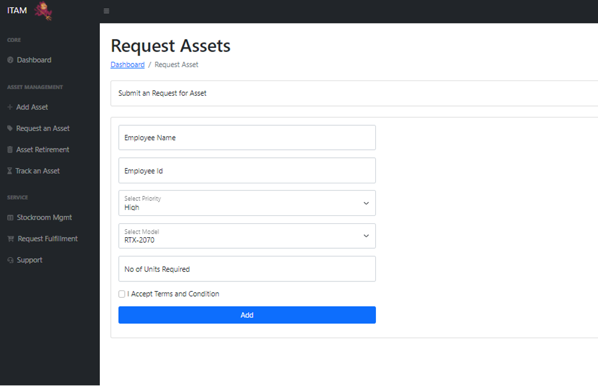

- **Request Fulfillment:** This page aids in the completion of user requests. After selecting a token from a drop-down list of probable requests, the details of the request are shown on the right in an easy-to-understand table. Using that information, the desired models may be selected from the preferred stockrooms, and asset records can be modified from this page. The requester can be notified of his order if he so desires.

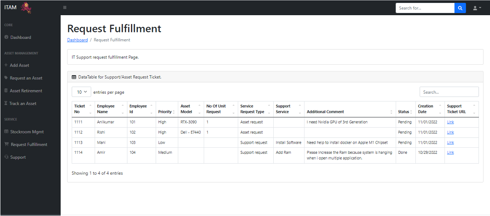

- **Support:** Maintenance assistance for existing assets may be requested in the same way that assets can be requested. Enter the asset's tagging ID and select a service type from a selection that includes Software Installation, RAM Addition, Hard Drive Replacement, and Computer Refresh. Following that, a request token ID is sent and satisfied.

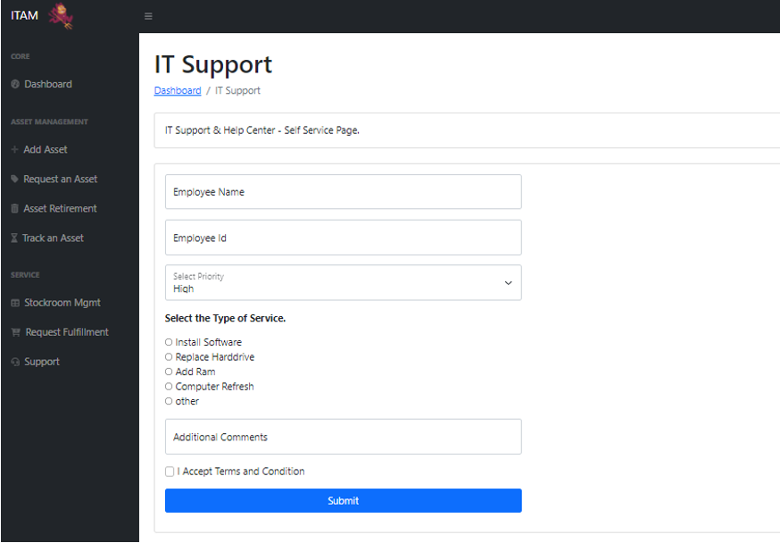

- **Asset Retirement:** This website facilitates the storing of asset retirement information. The model, tag, and serial number of the asset should be chosen, and the hard drive should be appropriately disposed of. The asset should then be moved to a warehouse for disposal, with the date of disposal noted.

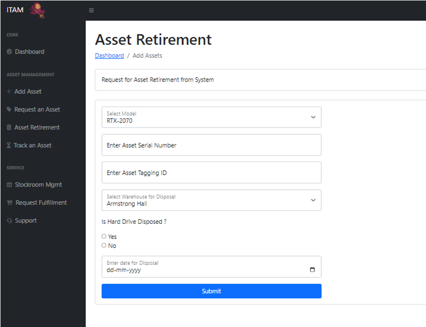

#### Wireframe 4 – Stockroom Management

- **Stockroom Management Page:** The interface brings you to the page seen once you click "Stockroom Management" in the Dashboard. As soon as you enter the page - Stock Room Management you will find two options, Add New Stockroom and Update the Stockroom, and bottom of that you can see the Data Table for Stockroom too. 

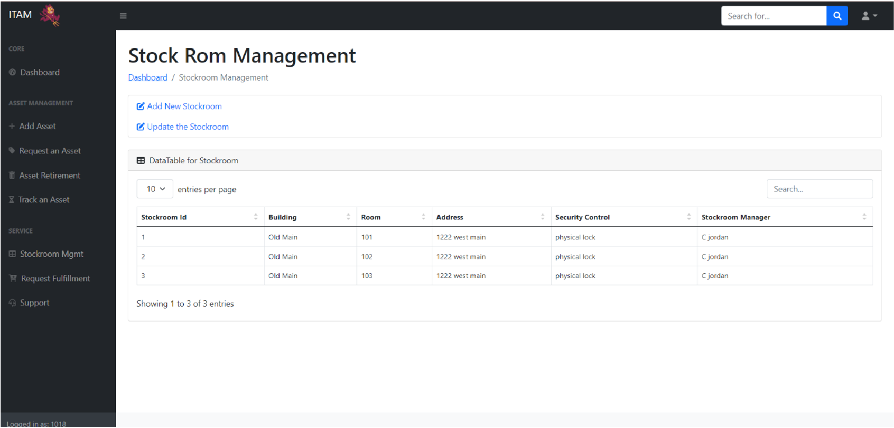

- **Adding New Stockroom:** As a new user if you want to add a new asset to the stockroom then you should click the Add New Stockroom check box. Once you enter you can find the options that are required to be filled in for Insertion of New Entry for the Stockroom the details that have to be filled in are Building Name, Room No, Address, Security Control (Physical lock, Knob lock, Cam Lock, etc.), and Stockroom Manager

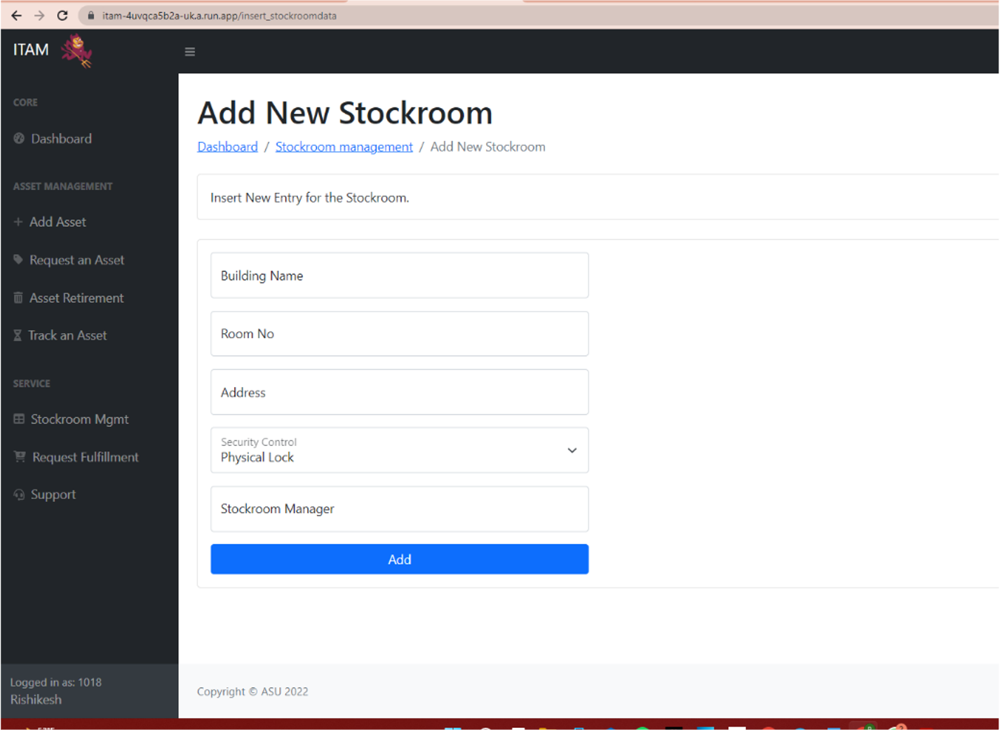

- **Updating Stockoom:** Now, to update the Stockroom we click the second option displayed on the Stockroom page which directs us to the “Update the Entry of Stockroom” page. It has the same blank boxes as adding a new entry, but the first box is replaced with Update by Stockroom Id and this is the main box that helps in updating the new location for the asset.

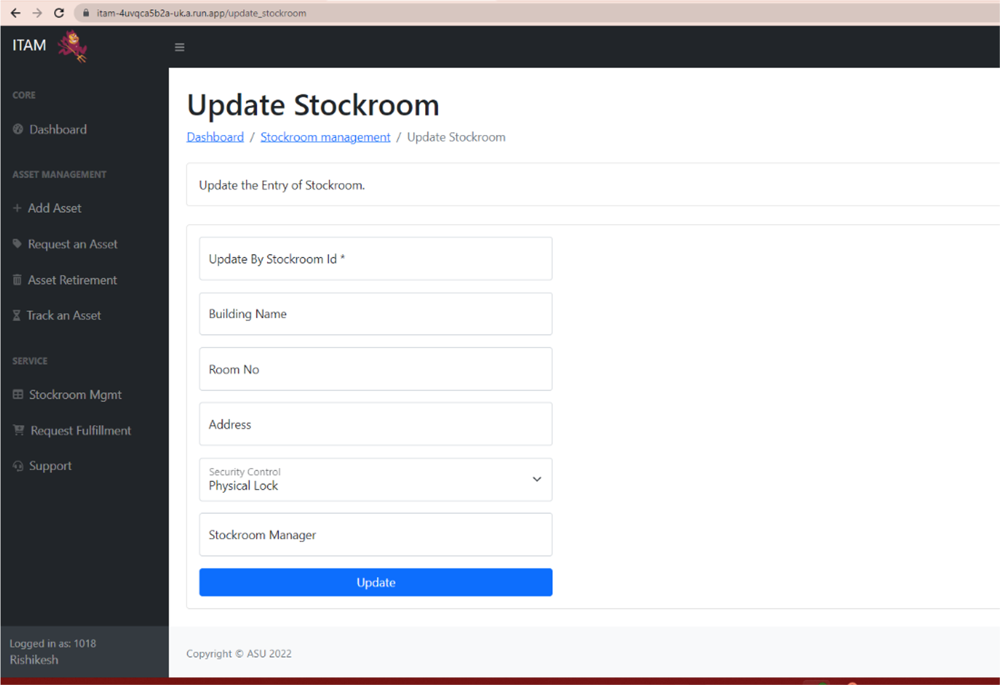

#### Wireframe 5 – Asset Tracking

- Tracking Assets is a method used to track the assets; this is done based on the Ticket Number provided for Serialized Asset Tracking. We can find this under Asset Management in the Dashboard of the ITAM. 

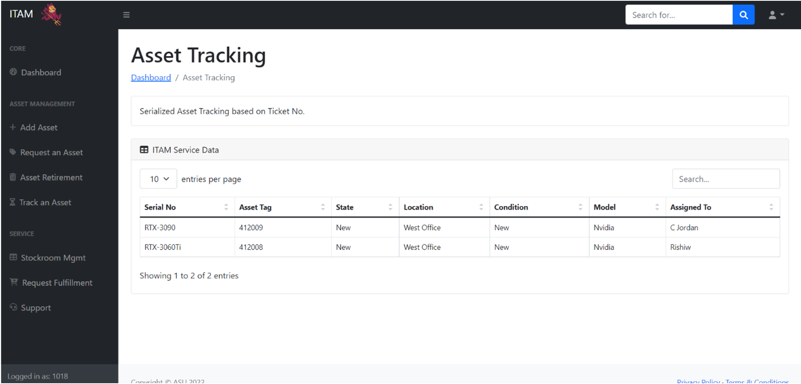

## Deployment in GCP Cloud Run

Make Sure to run the command from location where Docker File Exist in Local

```sh
gcloud run deploy --project Your-Project_NAME-GCP
```


